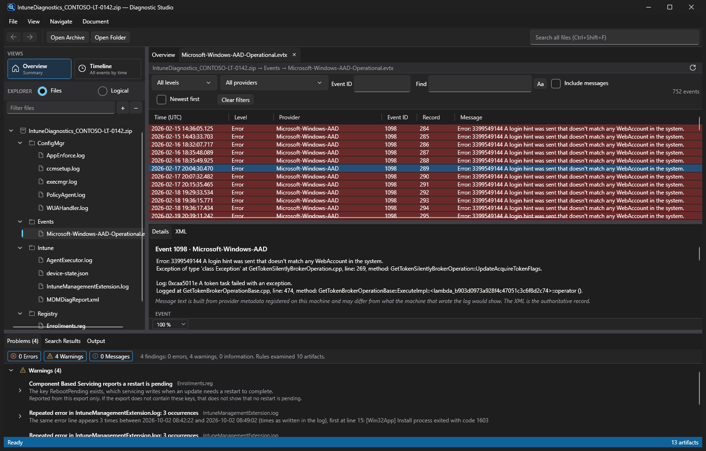
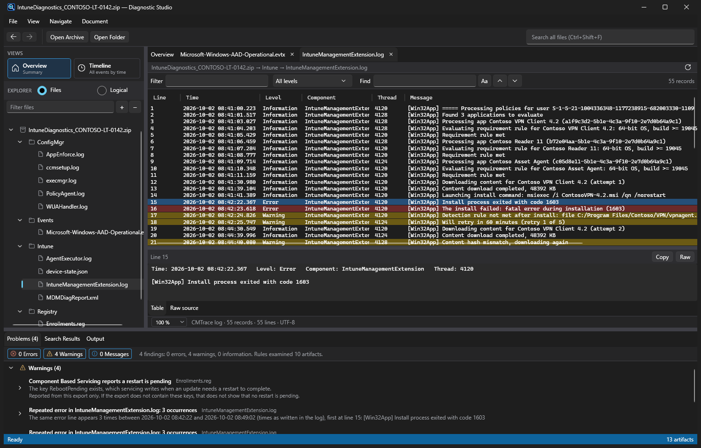
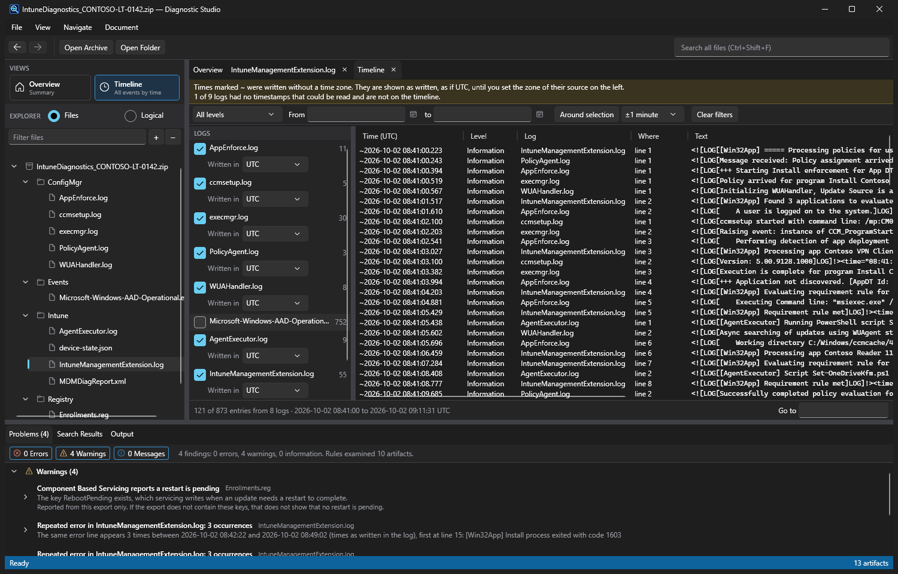
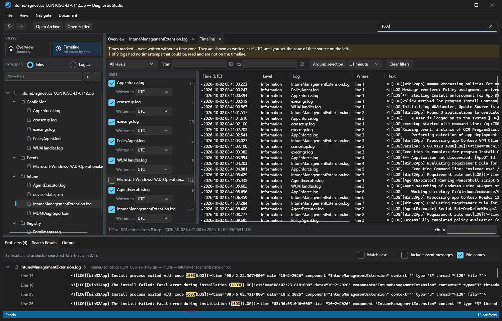

# Diagnostic Studio

A Windows desktop workspace for reading what a support collection left behind. Built for Intune and Configuration Manager (SCCM) engineers: drop in the archive from **Collect diagnostics** on an Intune-managed device, a ConfigMgr client log folder, an MDM diagnostics folder or any ZIP or CAB, and stay in one application. Browse the files, read CMTrace and plain logs, event logs, registry exports, JSON, XML, HTML and ETL traces, search across all of it, and follow findings back to the exact line they came from.

It replaces the usual round trip through File Explorer, Event Viewer, CMTrace, a registry viewer and an archive tool.



## At a glance

All of these were opened from one archive: a fictional co-managed laptop with a failing app install, plus an event log from an ordinary Windows machine.

| | |
| --- | --- |
|  |  |
| **CMTrace logs as a table.** `IntuneManagementExtension.log`, `AppEnforce.log`, `execmgr.log` and the rest, with errors and warnings tinted, a filter, find and the full message of the selected line. | **One timeline.** Every log's entries in time order, with a per-log switch and time zone. |
|  | |
| **Search the whole archive.** Find an exit code or an error number in every file at once; each hit opens at the matching line. | |

## Good for

- Intune: `IntuneManagementExtension.log`, `AgentExecutor.log`, MDM diagnostics reports, enrollment registry exports, event logs from a Collect diagnostics archive.
- Configuration Manager: client logs such as `AppEnforce.log`, `execmgr.log`, `WUAHandler.log`, `PolicyAgent.log` and `ccmsetup.log`, in CMTrace format.
- Co-managed devices, where the answer is spread across both sets of logs and the order things happened in matters.

## What it does

- **Opens an archive as a workspace.** ZIP and CAB archives (including archives nested inside them) and plain folders. Files are extracted to a private working folder; nothing in an archive is ever run.
- **One viewer per kind of file.**
  - Plain logs and text: virtualised, with line numbers, wrap, text selection and a line-based selection mode.
  - CMTrace logs (`<![LOG[`…`]LOG]!>`) and CSV/TSV files: a sortable table with a detail pane; multi-line messages stay one row.
  - Windows event logs (`.evtx`): level, provider, event id and rendered message, with the raw XML one click away.
  - Event trace logs (`.etl`): read with the Windows trace API; manifest and TraceLogging events are described, others keep their raw payload.
  - Registry exports (`.reg`): keys and values with their real types, including `MULTI_SZ`, `EXPAND_SZ` and exports from other tools.
  - JSON and XML: a collapsible tree, an indented Raw view, and a partial tree with the reason when a file is cut off.
  - HTML: drawn in a locked-down WebView2 (no network, no navigation, no downloads). An optional **Allow JavaScript** box lets a page's own inline scripts run; they still cannot fetch or send anything. A Source tab always shows the original text.
- **The raw source is always reachable.** Every parsed view has the original text behind it.
- **Search across the archive.** Free text plus `eventid:`, `provider:`, `level:` and `type:` filters; results stream in and open at the matching line or event.
- **Findings.** Deterministic, evidence-backed checks (application crashes, service terminations, pending reboot, repeated log errors). Each finding lists the events or lines it rests on.
- **Timeline.** Events and log lines from every log in the archive in time order; Ctrl+T shows the current line or event on it.
- **Problems panel.** Files that could not be read, were only partly read, have no viewer, are empty, or opened with a caution, each with the reason and a link to the first bad line. Errors, Warnings and Messages buttons with counts show or hide each severity.
- **Links everywhere.** Search hits, findings and timeline rows all open the source at the exact place; Back and Forward (Alt+Left / Alt+Right) retrace the steps.
- **Light, dark or follow Windows.** File > Preferences, under the Theme heading; the choice is remembered.
- **Two independent zoom levels.** Interface zoom (Ctrl + mouse wheel anywhere, Ctrl+plus/minus/0) and document zoom for the log, table, registry, tree and event views only (Ctrl + mouse wheel over a document, Ctrl+Shift+plus/minus/0, or the box in a viewer's status line). Both are 50–300 % and are remembered.

## Shortcuts

| Keys | Action |
| --- | --- |
| Ctrl+O / Ctrl+Shift+O | Open an archive / a folder |
| Ctrl+Shift+F | Find in all files |
| Ctrl+T | Show the current line or event on the timeline |
| Alt+Left / Alt+Right | Back / Forward |
| F5 | Re-read the file from disk |
| Ctrl+W | Close the tab |
| Ctrl+Shift+plus / minus / 0 | Document zoom in / out / reset |
| Ctrl+plus / minus / 0 | Interface zoom in / out / reset |

Click a file once to preview it in an italic tab that the next click replaces; double-click, or use the pin, to keep it.

## Safety

- The content of an archive is data. It is never executed, and nothing in it is launched; "Open in Notepad" and "Show in File Explorer" always pass the file as an argument to the editor or Explorer.
- Archive entries are checked against path traversal before extraction.
- A file that cannot be parsed is reported in the Problems panel and shown as raw text; it does not stop the application.
- The only place archive content reaches native code is the operating system's own CAB extractor and trace (ETL) reader.

## Download

Each [release](../../releases) has two builds of the same single-file program for 64-bit Windows. Unzip and run `DiagnosticStudio.exe`.

| Download | Needs | Size |
| --- | --- | --- |
| `…-framework-dependent.zip` | The [.NET 10 Desktop Runtime](https://dotnet.microsoft.com/download/dotnet/10.0) | Small |
| `…-self-contained.zip` | Nothing; the runtime is included | Larger |

The HTML viewer needs the Microsoft Edge WebView2 runtime, which is present on current Windows 11 and Microsoft 365 installs; without it the HTML source is shown instead.

## Build and run

Requires Windows 10 or later and the .NET 10 SDK.

```
dotnet build DiagnosticStudio.sln
dotnet test
```

The two release builds come from publish profiles:

```
dotnet publish src/DiagnosticStudio.App -p:PublishProfile=FrameworkDependent
dotnet publish src/DiagnosticStudio.App -p:PublishProfile=SelfContained
```

They are written under `src\DiagnosticStudio.App\bin\publish\`. Pushing a tag such as `v1.1.0` builds both and creates the release.

Run `src\DiagnosticStudio.App\bin\Debug\net10.0-windows\DiagnosticStudio.exe`, optionally with the path of an archive or folder to open it straight away.

Settings (the two zoom levels and the theme) are kept in `%AppData%\DiagnosticStudio\settings.json`.

## Layout

| Project | Role |
| --- | --- |
| `DiagnosticStudio.Core` | Models, locations and interfaces; no UI dependency |
| `DiagnosticStudio.Ingestion` | Archive and folder providers, file classification, safe extraction |
| `DiagnosticStudio.Parsers` | Text, CMTrace, CSV, EVTX, ETL, registry, JSON, XML and HTML parsers |
| `DiagnosticStudio.Search` | Global search |
| `DiagnosticStudio.Rules` | Findings and file health checks |
| `DiagnosticStudio.Timeline` | Timeline building |
| `DiagnosticStudio.App` | WPF shell, viewers and view models (MVVM) |
| `DiagnosticStudio.Tests` | xUnit tests |
